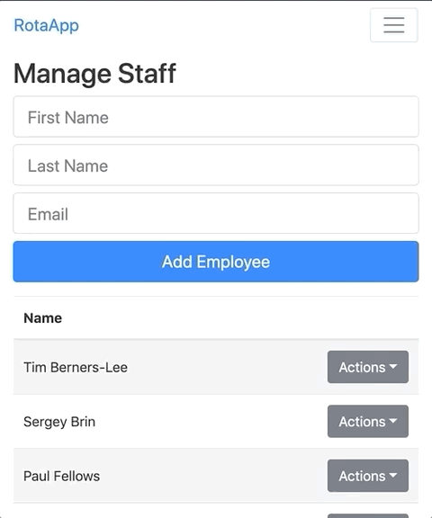

## About

This is my demo application for prospective employers.

Its purpose is to create schedules and manage employees. It provides a central place to coordinate who does what and when. If a new rota is published or an existing rota is updated, users will receive a notification by email.

This app is built with:

- [Create React App](https://github.com/facebook/create-react-app)
- [React Router](https://github.com/ReactTraining/react-router)
- [Reactstrap](https://reactstrap.github.io) - A Bootstrap 4 components library for React
- [Firebase](https://firebase.google.com)
  - Auth
  - Cloud Firestore (NoSQL database)
  - Cloud Functions
  - Hosting

This app uses:

- [SendGrid](https://sendgrid.com) - To send email

## Features

| Create new employee               | Update/delete employee             |
| --------------------------------- | ---------------------------------- |
|  |  |

| Create new rota                  | Update/delete rota               |
| -------------------------------- | -------------------------------- |
|  |  |

## Demo

You can find the demo hosted [here](https://rota-app-65e11.web.app). There are two accounts you can sign-in with.

| Email                          | Password | Type  |
| ------------------------------ | -------- | ----- |
| paul99fellows[at]gmail[dot]com | password | Admin |
| johndoe[at]gmail[dot]com       | password | User  |
